<div align="center">
  
  <h1>Skill Atlas Workbench</h1>
</div>

**Launch Application:**
- [Access on Vercel](https://atlas-skills.vercel.app/)
- [Access on Netlify](https://atlas-skills.netlify.app/)

## Introduction & Purpose

As AI agents and LLM-based systems scale in complexity, they often rely on dozens of interconnected, specialized markdown instructions (known as "skills"). Managing these skills as flat text files across a codebase quickly becomes unmanageable—leading to broken dependencies, circular logic, and context window bloat.

**Skill Atlas** is a standalone, serverless IDE designed specifically to solve this problem. It parses your entire skill repository and automatically constructs a visual Directed Acyclic Graph (DAG). 

By treating your agent's instructions as a compiled dependency tree, Skill Atlas allows you to:
- Visually map the execution path and dependencies between different LLM instructions.
- Ensure strict compliance with Anthropic and OpenAI guidelines for atomic, composable skills.
- Safely edit markdown skills in the browser and securely push them directly back to GitHub as Pull Requests.
<details>
  <summary><b>View Visual Feature Tour</b></summary>
  
  <br/>

  **1. Bring Your Own LLM (BYOK)**
  <br/>
  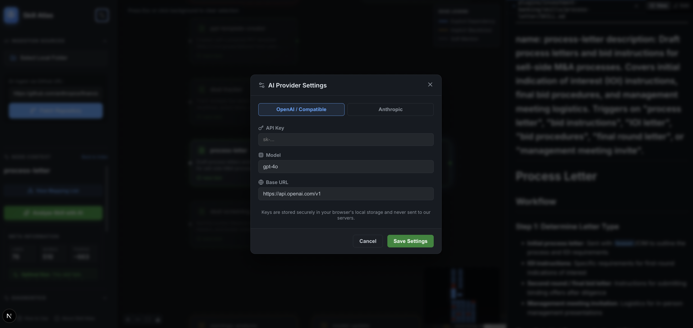
  <br/>
  <i>Securely configure your own OpenAI or Anthropic API keys directly in the browser. Keys are stored locally, unlocking advanced AI diagnostics and skill analysis without sending credentials to any central server.</i>
  
  <br/><br/>

  **2. Real-time Analytics & Token Limits**
  <br/>
  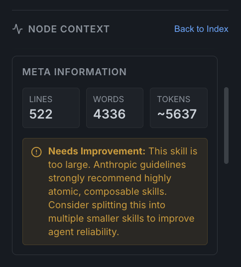
  <br/>
  <i>The Node Context panel computes real-time metadata (lines, words, token estimates) and actively flags oversized skills that violate Anthropic's optimal token limits for atomic, composable skills.</i>
  
  <br/><br/>

  **3. Cmd+K Command Palette Navigation**
  <br/>
  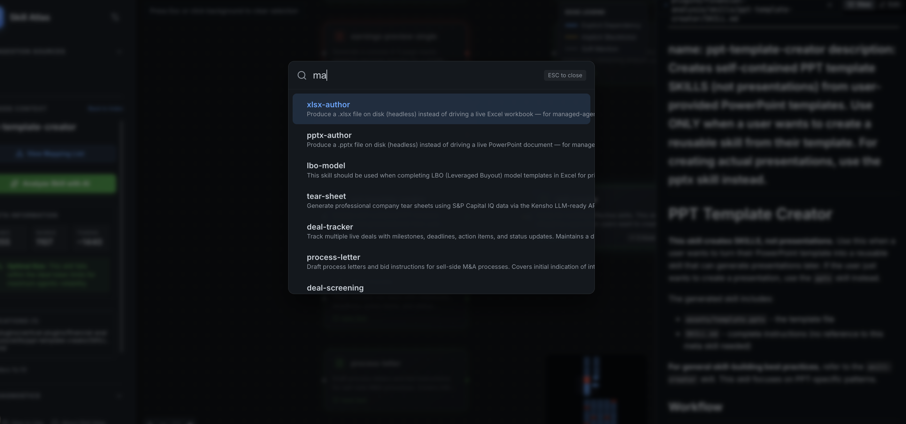
  <br/>
  <i>A global omnibar search allows you to instantly search across your entire repository and jump directly to specific skills, assets, or markdown files without taking your hands off the keyboard.</i>
  
  <br/><br/>

  **4. Cross-Repository Duplication Tracking**
  <br/>
  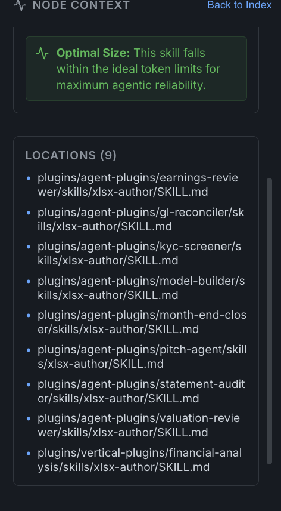
  <br/>
  <i>Automatically tracks and lists duplicated skill files across multiple locations in the repository (e.g., across different agent plugins) to help you manage redundancy.</i>
  
  <br/><br/>

  **5. Advanced Edge Highlighting & Dependency Tracing**
  <br/>
  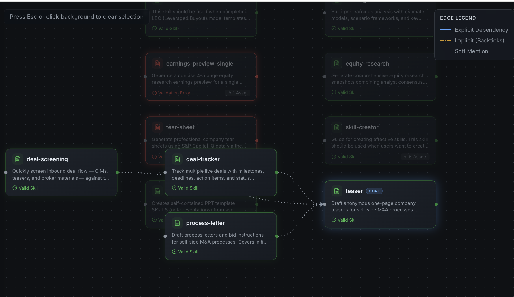
  <br/>
  <i>Clicking any node intelligently dims unrelated parts of the graph while illuminating its exact execution path. A clear legend differentiates between Explicit Dependencies (direct calls), Implicit Dependencies (backtick references), and Soft Mentions.</i>
  
  <br/><br/>
  
  **6. Secure GitHub Pull Requests**
  <br/>
  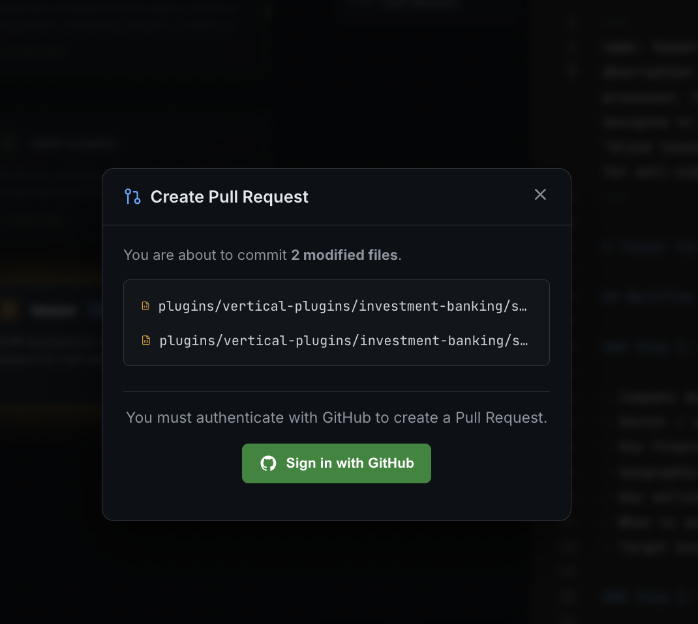
  <br/>
  <i>Directly authenticate with GitHub via OAuth to review staged modifications and securely open Pull Requests straight from the workbench without needing the CLI.</i>

  <br/><br/>
  
  **7. Interactive PR Diff Viewer**
  <br/>
  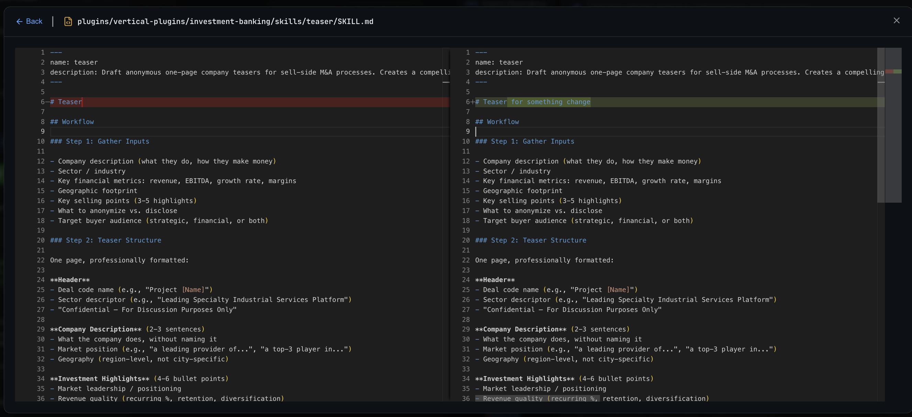
  <br/>
  <i>Before pushing changes, use the built-in side-by-side Monaco Diff Editor to visualize your local staged modifications against the baseline codebase with full syntax highlighting.</i>

  <br/><br/>

  **8. AI-Assisted Skill Editing**
  <br/>
  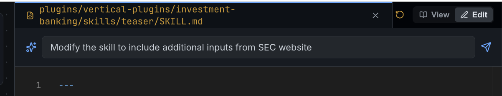
  <br/>
  <i>Leverage your configured LLM API keys to naturally prompt for changes directly within the editor. The embedded AI Copilot will automatically modify the skill based on your instructions.</i>
</details>

## Anthropic Skill Validation Rules

Skill Atlas comes pre-configured with a strict diagnostics engine that enforces best practices for AI agent instructions based on Anthropic's guidelines for atomic and composable skills.

The engine actively flags violations across the graph:
1. **Token Optimization:** Warns when skills exceed optimal token limits, preventing context window bloat.
2. **Cyclic Dependencies:** Detects infinite loops and circular logic where skills recursively call each other.
3. **Orphan Detection:** Identifies isolated skills that have no entry points or parent references.
4. **Metadata Strictness:** Enforces required YAML frontmatter (name, description, inputs) to ensure downstream tools can execute the skills.

## Video Demonstrations

### 1. Visual Node Graph
Built with React Flow, it instantly maps out your entire skill repository and its dependencies, giving you a top-down view of all agent instructions.

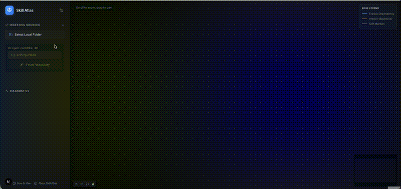

### 2. Real-time Diagnostics
Validates skills against strict rules (e.g., no cycles, orphans, missing frontmatter) and flags them with contextual explanations to maintain repository health.

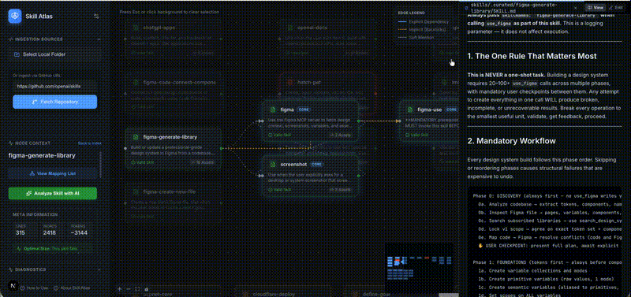

### 3. Integrated IDE & Notebook Renderer
A split-pane Monaco Editor allows you to directly edit Markdown and Code files within the browser with real-time updates to the graph. It also features native **Jupyter Notebook (.ipynb)** parsing, rendering Markdown blocks and Code cells seamlessly within the app.

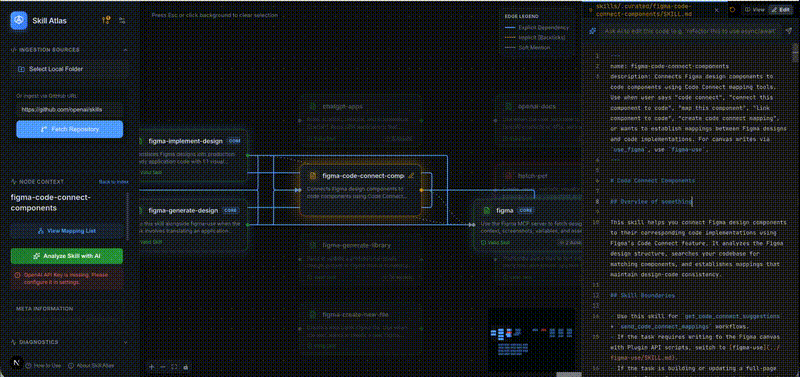

### 4. GitHub Integration & PRs
Fetches skills directly from remote GitHub repositories and pushes modifications securely back as Pull Requests using GitHub OAuth.

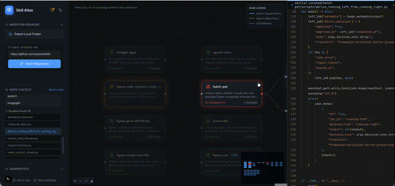

## Local Development

To run the application locally, simply install the dependencies and start the development server:

```bash
npm install
npm run dev
```

Open [http://localhost:3000](http://localhost:3000) in your browser.
